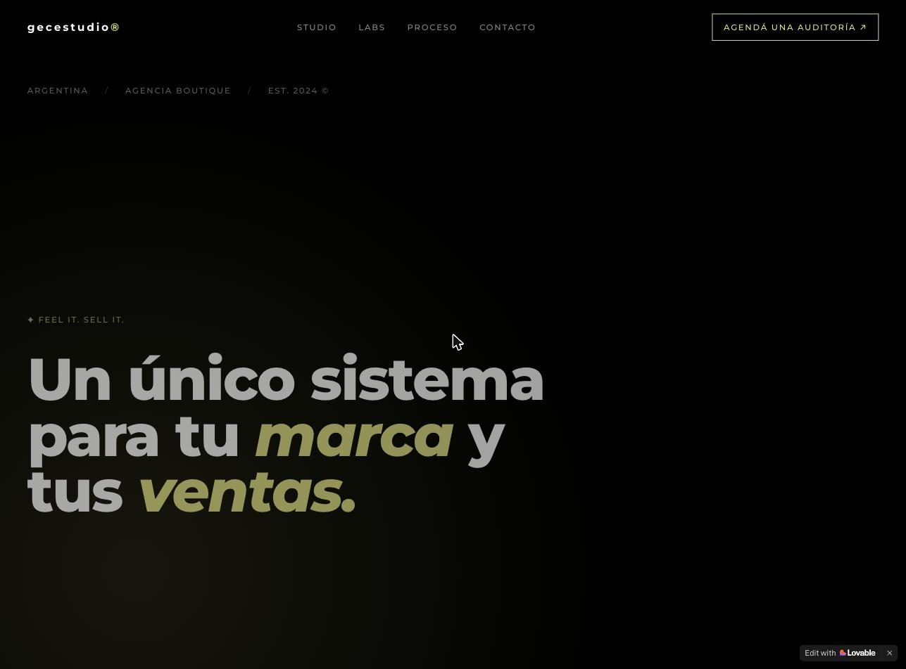
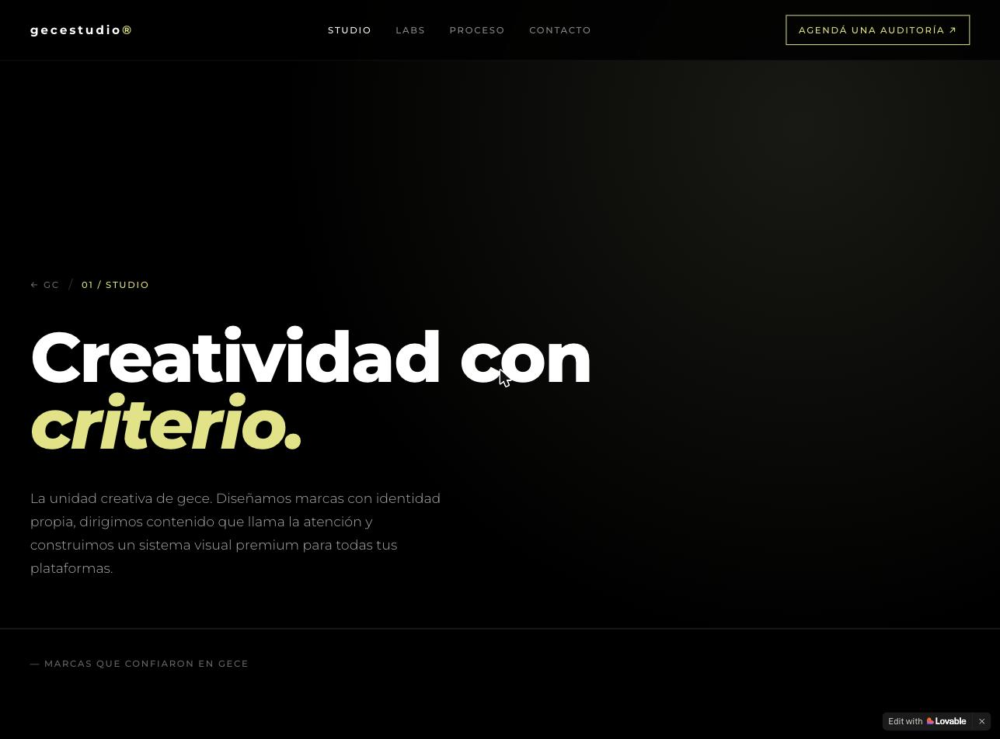
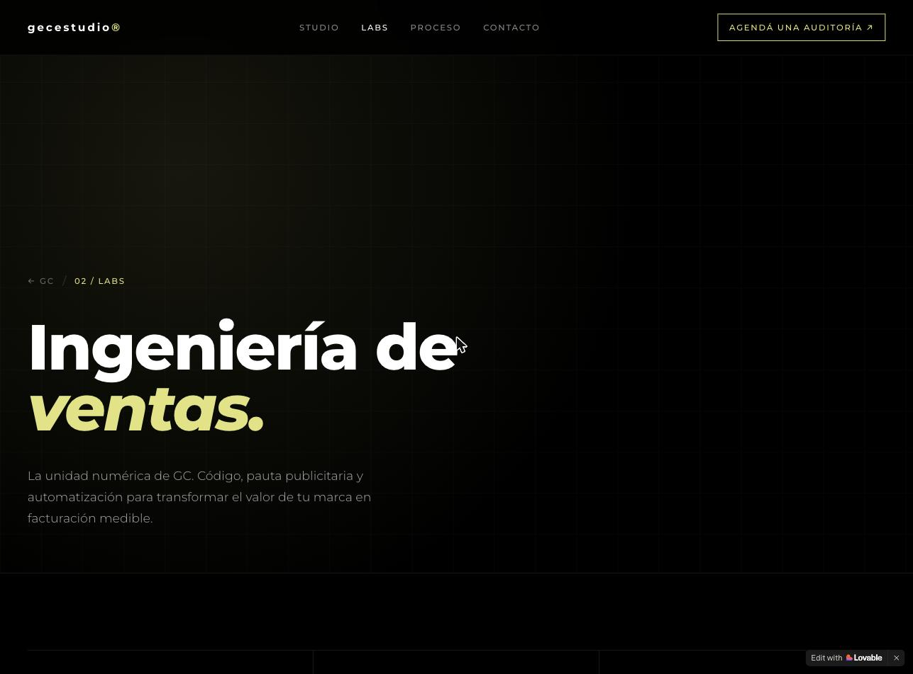

# gecestudio - Sistema integrado de marca y crecimiento

FEEL IT. SELL IT.

Documentacion completa del sitio web de gecestudio, agencia boutique argentina fundada en 2024.

---

## Que es gecestudio

gecestudio es un partner integrado de crecimiento que fusiona creatividad y performance en un mismo equipo. Conecta lo que otras agencias ejecutan por separado: una marca que enamora y una infraestructura que vende.

Pais: Argentina
Tipo: Agencia boutique
Fundacion: Est. 2024

---

## Capturas del sitio

### Home

### GC Studio

### GC Labs

---

## Estructura del repositorio

README.md — Resumen general
paginas/home.md — Contenido pagina principal
paginas/studio.md — Contenido GC Studio
paginas/labs.md — Contenido GC Labs
contacto.md — Datos de contacto y redes
home.png / studio.png / labs.png — Capturas de las paginas

---

## Las dos unidades

GC Studio: Identidad, percepcion y direccion creativa
GC Labs: Infraestructura, performance e ingenieria de conversion

---

## Stack tecnologico sugerido para reproducir el sitio

Para reconstruir un sitio con esta estetica (fondo oscuro, tipografia grande, animaciones de entrada y scroll), se sugiere:

Framework: React + Vite (o Next.js si se busca SSR/SEO)
Estilos: Tailwind CSS para el sistema de diseno y utilidades
Animaciones: Framer Motion (entrada de textos) y un marquee/scroll para la cinta de palabras
Tipografia: una sans-serif geometrica de alto contraste (estilo grotesque) con peso bold para los titulos y un acento en italica para las palabras destacadas
Color: paleta oscura (negro/gris muy oscuro) con un unico acento verde lima para resaltar palabras y CTAs
Ruteo: React Router (rutas /, /studio, /labs)
Componentes clave: navbar fijo, hero a pantalla completa, tabla comparativa, grilla de servicios, secciones de pasos/fases, carrusel de testimonios, footer con contacto
Iconografia: simbolos minimalistas (asteriscos, flechas) coherentes con la marca
Despliegue: Vercel o Netlify

---

## Contacto

Instagram: @studiogece
TikTok: @gece.studio
WhatsApp: +54 9 3415 49-0701
Email: gecestudiocomercial@gmail.com

Ubicacion: Argentina
Slogan: feel it. sell it.

---

(c) 2026 GECESTUDIO. ALL RIGHTS RESERVED.
